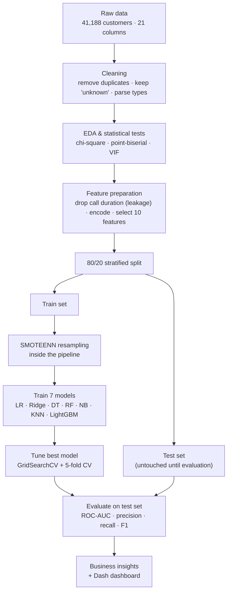

# Telecom Marketing Campaign: Customer Subscription Prediction

Predicting which customers will subscribe to a new telecom plan, so marketing can stop calling people who won't convert.

**Why it matters:** in this campaign about 9 out of 10 calls ended in a "no." A model that ranks customers by how likely they are to subscribe lets a sales team make fewer calls and still win most of the sign-ups.

**Results at a glance**
- **LightGBM** was the best of 7 models, with **ROC-AUC 0.795** (5-fold CV: 0.773 ± 0.009)
- **3.5× lift** in conversion rate: precision of 0.398 vs. an 11.3% baseline
- **Wasted calls cut from 88.7% to 60.2%** while still reaching **61% of true subscribers**
- Built a leakage-free pipeline: call duration excluded, SMOTEENN applied only inside training folds

---

## Business problem
A telecom company contacted 41,188 customers by phone about a new plan, and only **11.26% subscribed**. Calling everyone wastes most of the campaign budget. The goal is to find who is likely to say yes, and when and how to reach them.

## The data
Each row is one customer contacted during the campaign, with **21 columns** in four groups:

| Group | Example columns | What it tells us |
|---|---|---|
| **Customer profile** | age, job type, marital status, education, loans, credit default | Who the customer is |
| **Current campaign** | contact method (cellular/telephone), month, day of week, number of calls | How and when they were contacted |
| **Past campaigns** | days since last contact, previous contacts, previous outcome | Whether they've responded before |
| **Economic context** | 3-month Euribor rate, employment variation, consumer price and confidence indices, number of employees | The economic climate at the time of the call |

**Target:** `is_subscribed` (yes/no). Only 11.26% of customers said yes, so the classes are heavily imbalanced.

**Data quality notes**
- No missing values, but 6 columns contain `"unknown"`, for example 20.9% of `has_credit_default`. I kept it as its own category rather than guessing.
- I removed 12 duplicate rows, leaving 41,168 records.
- I excluded `call_duration_sec`. It's the strongest predictor, but it's only known *after* the call ends, so using it would leak the answer into the model.
- The raw file is semicolon-delimited and isn't included in this repo (see [Run it locally](#run-it-locally)).

## Workflow

## Approach
1. **Cleaning:** parsed a semicolon-delimited file, removed 12 duplicates, and kept "unknown" as its own category
2. **EDA and statistics:** chi-square tests (all categorical features significant, p < 0.001), point-biserial correlations, and VIF, which found severe multicollinearity in the economic features
3. **Leakage control:** dropped `call_duration_sec`, which is only known after the call ends
4. **Feature selection:** ExtraTrees importance, which kept 10 features
5. **Imbalance:** SMOTEENN inside an sklearn Pipeline, so synthetic samples never touch the test data
6. **Modelling:** 7 models across parametric and non-parametric families, an 80/20 stratified split, GridSearchCV tuning and 5-fold CV
7. **Inference:** a statsmodels logit for odds ratios and a Beta-Binomial check on the subscription rate

## Results

| Model | Precision | Recall | F1 | ROC-AUC |
|---|---|---|---|---|
| **LightGBM** | **0.401** | 0.635 | **0.492** | **0.795** |
| Random Forest | 0.329 | 0.679 | 0.443 | 0.794 |
| Decision Tree | 0.284 | 0.672 | 0.399 | 0.785 |
| Gaussian Naive Bayes | 0.272 | 0.721 | 0.395 | 0.780 |
| Logistic Regression | 0.259 | **0.729** | 0.382 | 0.776 |
| Ridge LR | 0.254 | 0.733 | 0.377 | 0.775 |
| KNN | 0.215 | 0.707 | 0.330 | 0.746 |

ROC-AUC was the main metric. With 88.7% negatives, a model that always predicts "no" gets about 89% accuracy while finding zero subscribers, so accuracy is misleading here. LightGBM and Random Forest are nearly tied on AUC; I chose LightGBM for its clearly better precision and F1.

## Key insights
- **Re-contact past converters:** customers whose previous campaign succeeded subscribed at **65.1%**, compared with an 11.3% average.
- **Target the 60+ and 18–30 age groups:** customers aged 60+ subscribed at 45.5% and those aged 18–30 at 15.2%. By job type, students (31.4%) and retired customers (25.2%) led, while blue-collar workers were lowest (6.9%).
- **Timing matters:** subscriptions were higher when the 3-month Euribor rate was low, and peaked in March, September and October.
- **Use cellular and cap at 3 calls:** cellular converted at 14.7% vs. 5.2% for telephone, and conversion falls steadily after the third contact.

## Limitations
- The random train/test split may overstate real-world performance, so a time-based split is the next step.
- The data reflects a single economic period, so the model would need periodic retraining.
- Label encoding treats nominal categories as ordered; one-hot encoding is planned instead.
- Grid search slightly reduced AUC (0.7946 → 0.7905), so Optuna is a planned upgrade.

## Tech stack
Python · pandas · scikit-learn · imbalanced-learn · LightGBM · statsmodels · SciPy · matplotlib · seaborn · Plotly Dash

## Repository structure

| Path | Description |
|---|---|
| `notebooks/Marketing_Campaign_Analysis.ipynb` | Full analysis: cleaning, EDA, statistical tests, modelling, tuning |
| `telecom_dashboard.py` | Interactive dashboard: EDA, campaign analysis, model benchmarking, live predictor |
| `images/` | README figures |
| `data/` |
