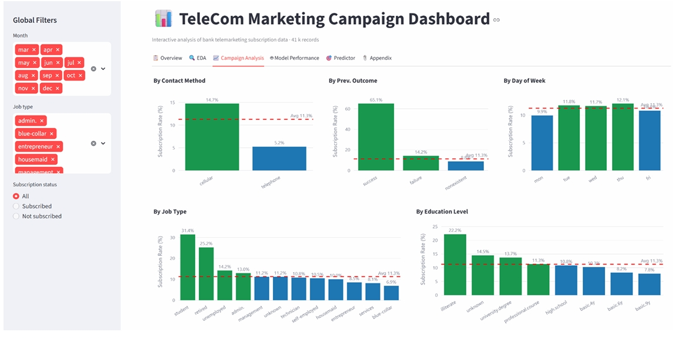
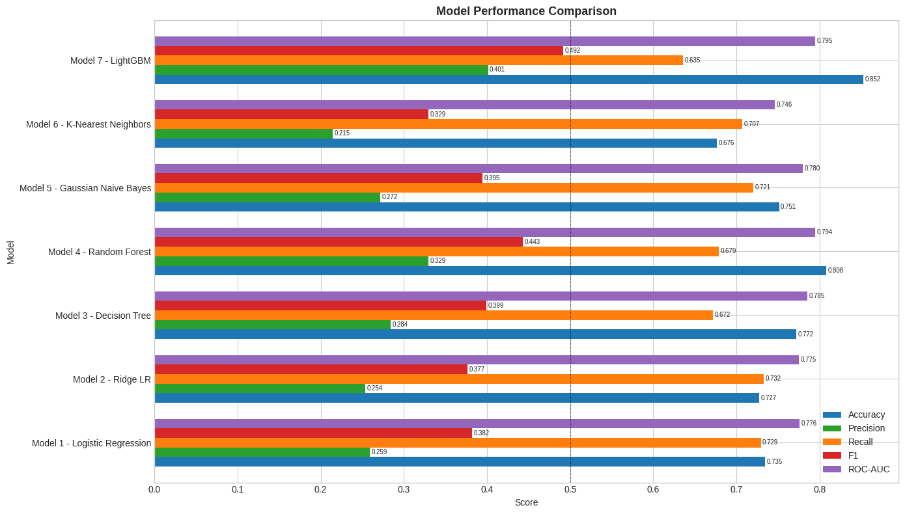
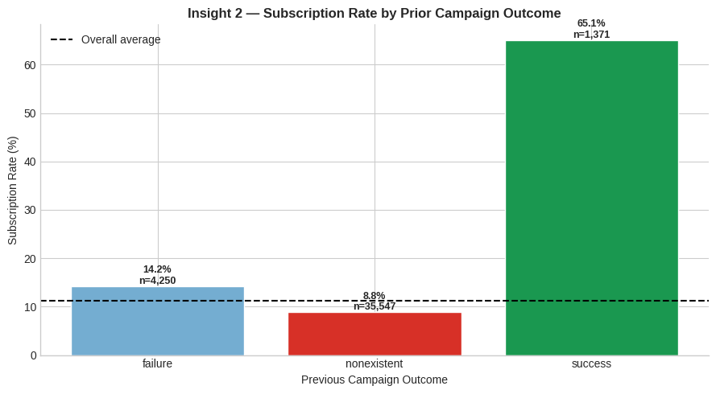

# Telecom Campaign: Predicting Plan Subscriptions

Predicting which customers will subscribe to a new telecom plan, so marketing can stop calling people who won't convert.

**Results at a glance**
- **LightGBM** was the best of 7 models, with **ROC-AUC 0.795** (5-fold CV: 0.773 ± 0.009)
- **3.5× lift** in conversion rate: precision of 0.398 vs. an 11.3% baseline
- **Wasted calls cut from 88.7% to 60.2%** while still reaching **61% of true subscribers**
- Built a leakage-free pipeline: call duration excluded, SMOTEENN applied only inside training folds




---

## Business problem
A telecom company contacted 41,188 customers about a new plan, and only **11.26% subscribed**. Calling everyone wastes most of the campaign budget. The goal is to find who is likely to say yes, and when and how to reach them.

## Approach
1. **Cleaning:** parsed a semicolon-delimited file, removed 12 duplicates, and kept "unknown" as its own category
2. **EDA and statistics:** chi-square tests (all categorical features significant, p < 0.001), point-biserial correlations, VIF (found severe multicollinearity in the macroeconomic features)
3. **Leakage control:** dropped `call_duration_sec`, which is only known after the call ends
4. **Feature selection:** ExtraTrees importance, which kept 10 features
5. **Imbalance:** SMOTEENN inside an sklearn Pipeline, so synthetic samples never touch the test data
6. **Modelling:** 7 models across parametric and non-parametric families, an 80/20 stratified split, GridSearchCV tuning and 5-fold CV
7. **Inference:** a statsmodels logit for odds ratios and a Beta-Binomial check on the subscription rate

## Results

| Model | Precision | Recall | F1 | ROC-AUC |
|---|---|---|---|---|
| **LightGBM** | **0.401** | 0.635 | **0.492** | **0.795** |
| Random Forest | 0.329 | 0.679 | 0.443 | 0.794 |
| Decision Tree | 0.284 | 0.672 | 0.399 | 0.785 |
| Gaussian Naive Bayes | 0.272 | 0.721 | 0.395 | 0.780 |
| Logistic Regression | 0.259 | **0.729** | 0.382 | 0.776 |
| Ridge LR | 0.254 | 0.733 | 0.377 | 0.775 |
| KNN | 0.215 | 0.707 | 0.330 | 0.746 |

ROC-AUC was the main metric. With 88.7% negatives, a model that always predicts "no" gets about 89% accuracy while finding zero subscribers, so accuracy is misleading here.



## Key insights
- **Re-contact past converters:** a successful previous campaign was the strongest behavioural predictor (χ² = 4217.7).
- **Target retired and student customers:** they subscribed at 76.3% and 51.4%, compared with 9.8% for blue-collar workers.
- **Timing matters:** the 3-month Euribor rate and number of employees were the top predictors. Subscriptions rose when rates were low, and peaked in March, September and October.
- **Use cellular and cap at 3 calls:** cellular beat telephone, and conversion falls sharply after the third contact.



## Limitations
- The random train/test split may overstate real-world performance, so a time-based split is the next step.
- The data reflects a single economic period, so the model would need periodic retraining.
- Label encoding treats nominal categories as ordered, and one-hot encoding is planned instead.
- Grid search slightly reduced AUC (0.7946 → 0.7905), so Optuna is a planned upgrade.

## Tech stack
Python · pandas · scikit-learn · imbalanced-learn · LightGBM · statsmodels · SciPy · Plotly Dash

## Repository structure

| Path | Description |
|---|---|
| `notebooks/Marketing_Campaign_Analysis.ipynb` | Full analysis: cleaning, EDA, statistical tests, modelling, tuning |
| `telecom_dashboard.py` | Interactive dashboard: EDA, campaign analysis, model benchmarking, live predictor |

| `images/` | README figures |
| `data/` | Put the dataset here (not included) |

## Run it locally

```bash
pip install -r requirements.txt
# put TeleCom_Data-1.csv in data/ (or set TELECOM_DATA_PATH)
python telecom_dashboard.py
```

Open http://127.0.0.1:8050. On startup the app trains all models, which takes about a minute because of SMOTEENN.

The dataset (`TeleCom_Data-1.csv`, semicolon-delimited) isn't included. The notebook was written in Google Colab and reads from `/content/TeleCom_Data-1.csv`, so update that path if you run it locally.

---
*Master of Data Science and Innovation, UTS* · [Your name] · [LinkedIn]
